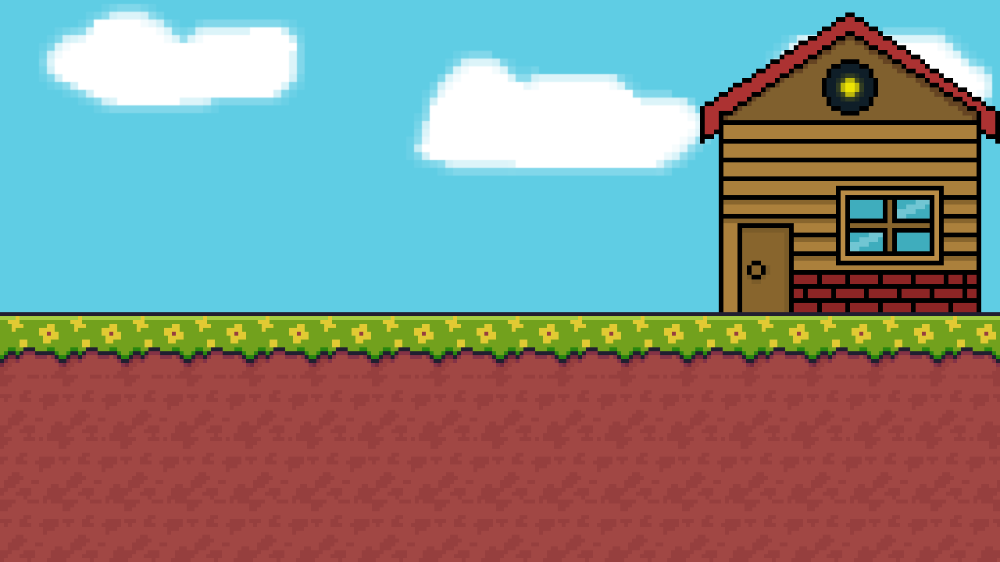

  <h1 style="font-size: 48px;">Jimpu</h1>

  

Jimpu is a simple 2D Jump 'n' Run.
It is in early development and
not near finished. I will try my best
to make it a fun game.

**🚧 Development Status 🚧**

It is at version 0.1. It will release
when it reaches 1.0.

**⚙️ Future ⚙️**

I want the game to be free and public.
As it is my first game that I made, I want
at least 5 levels and a full working shop +
inventory system so you can buy items.

**📬 Ideas 📬**

If you got any ideas, features, or problems,
please send me an email or create an issue.

